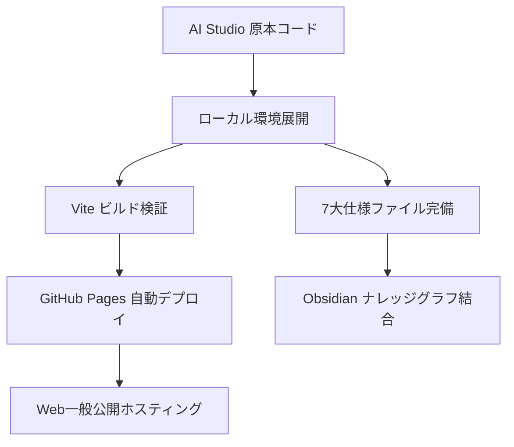

# 📋 CADZUMEN: タスク管理 & 依存関係マトリクス (task-list.md)

本ドキュメントは、CADZUMEN の現在進行中・完了・未着手タスク一覧と依存関係を管理します。

---

## 1. タスク進捗ステータス

### ✅ 完了済みタスク (Completed)
- [x] Google AI Studio プロトタイプ作成 (`053b7942-6942-4288-b95a-30bf9e867904`)
- [x] GitHub リポジトリ開設 (`yamatotakeru616/CADZUMEN`)
- [x] AI Studio 原本コード（React 19 / Vite / 社寺建築DXFエンジン）のローカル完全同期
- [x] 依存パッケージ解決 (`npm install --legacy-peer-deps`)
- [x] プロダクションビルド疎通検証 (`npm run build` PASS)
- [x] Vite 開発サーバー稼働 (`http://localhost:3001`)
- [x] AI Studio ZIP 自動配置 CLI & 常時監視デーモンの整備 (`.agents/tools/aistudio_zip_importer.py`)
- [x] GitHub Pages 自動デプロイ CI/CD ワークフロー配備 (`.github/workflows/deploy.yml`)
- [x] Vite base 相対パス設定 (`base: './'`)
- [x] エージェント標準仕様 7大ファイル完備 (`GEMINI.md`, `skills.md`, `ハーネス.md`, `ループAgent.md`, `フック.md`, `task-list.md`, `機能一覧.md`)
- [x] Obsidian Vault ナレッジノート（`CADZUMEN.md` / `AIStudio/CADZUMEN.md`）作成・WikiLink統合
- [x] マスターカタログ（`projects_master.json` / `全アプリ統合一覧.md`）自動同期

### ⏳ 進行中・次期フェーズタスク (In Progress / Next)
- [ ] Three.js による海中廻廊・大鳥居の 3D リアルタイムウォークスルー空間の実装
- [ ] Jw_cad (JWW / JWC) 形式への直接エクスポート機能の追加
- [ ] [[00_Knowledge/Projects/QGIS-Civil-Master|QGIS-Civil-Master]] との宮島現況地形（PLATEAU/DEM）敷地統合
- [ ] 木割（きわり）パラメータの動的スライダーカスタマイズ UI の実装

---

## 2. 依存関係マトリクス (Dependency Matrix)

