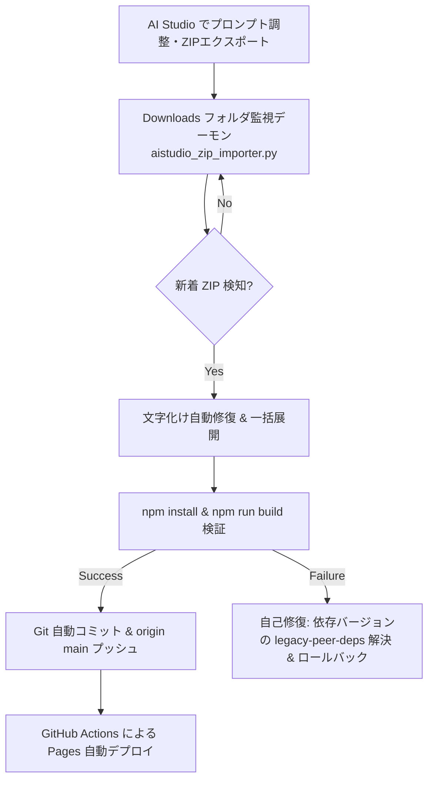

# 🔄 CADZUMEN: 自律ループ・常時監視・自己修復規定 (ループAgent.md)

本仕様書は、CADZUMEN の実行健全性監視、AI Studio からの自動取り込み、およびクラッシュ時・構文不正時の自己修復サイクルを定めます。
詳細なループ設計は [src/docs/LoopAgent.md](src/docs/LoopAgent.md) と連動します。

---

## 1. 自律監視サイクル (Autonomous Watch Cycle)

---

## 2. 自己修復プロトコル (Self-Healing Protocol)

1. **ZIP 文字化け自己修復**:
   - `DOC_SIZE_MAP` を用いて、Windows ZIP 解凍時に発生しやすいファイル名破損（`src/docs/*.md`）をバイトサイズから決定論的に自動修復。
2. **Peer Dependencies 競合自己修復**:
   - React 19 と一部プラグイン（esbuild/tsx 等）の Peer 依存競合検知時は、自動で `--legacy-peer-deps` オプションを付与してインストールを完了させる。
3. **Canvas 座標外れ修復**:
   - 縮尺変換でエンティティが描画領域外へ外れた場合、バウンディングボックスの最小・最大座標からセンタリングオフセットを自動再計算（Fit-to-Screen）。
